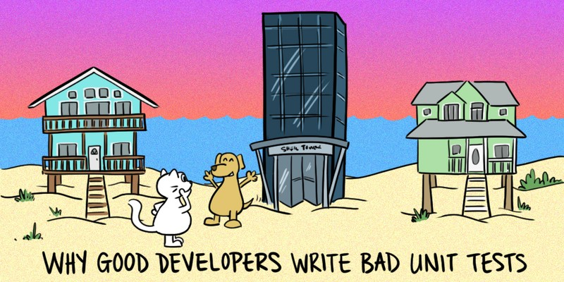

= How not to write tests — 'Unit' Testing in .NET
:revealjs_theme: white
:icons: font
:revealjs_slideNumber: c/t
:revealjs_controls: true
:customcss: nc-template.css
:source-highlighter: highlightjs
:revealjs_width: 1400
:revealjs_hash: true

Revising classic approach to unit testing and finding pitfalls in it.
Improving code and tests based on TDD and BDD approaches.

== $ whoami

* Software developer for 6.5 years
* Hacker wanna-be
* Author of small coding/security blog - https://matishadow-blog.gear.host/posts/[link]
* All other links https://about.me/matishadow[here]

== Assumptions

* You know .NET Core
* You wrote at least a couple of unit tests
* You have an open mind

== Agenda

. Key takeaways (lightning talk version)
. But why do we need tests?
. Characteristics of classic unit tests
. Problems with classic unit tests
. Band-aids
. 'Good developers write bad tests'
. Benefits of TDD flow

== Recommendations

=== 🚀 DevTernity 2017: Ian Cooper - TDD, Where Did It All Go Wrong
video::EZ05e7EMOLM[youtube]

=== https://www.amazon.com/Test-Driven-Development-Kent-Beck/dp/0321146530['Test Driven Development: By Example' by Kent Beck]

https://www.amazon.com/Test-Driven-Development-Kent-Beck/dp/0321146530[]

=== https://mtlynch.io/good-developers-bad-tests/[Why Good Developers Write Bad Unit Tests]

https://mtlynch.io/good-developers-bad-tests/[]

== Key takeaways

[%step]
* Write a test when a new requirement comes, not when you create new class/method.
* Use encapsulation in a module. Keep implementation details in internal classes, test only public ones.
* Use mocks only when super necessary i.e., with databases, network, files etc.

=== !

[%step]
* TDD lets you focus on one thing at a time. First working solution then good design.
* Good test shouldn't break when refactoring the code.
* Isolate tests from each other, not classes.
* When using hexagonal architecture test only ports/use cases.

== Glossary

[%step]
* Refactoring - Changing implementation details without changing the behavior.
* TDD (Test Driven Development) - Approach in which first you write failing test,
  then you write ugly code to make it pass, and then you refactor the code to make it less ugly.
* BDD -
* Design Patterns -

== But why do we need tests?

[%step]
* Certainty that the project works (less time testing manually)
* Safe refactoring
* Good tests are living documentation

== Characteristics of classic unit tests

== Problems with classic unit tests

== Band-aids

== 'Good developers write bad tests'

== Benefits of TDD flow

[%step]
* Red-Green-Refactor
* Our brain cannot focus on two things at once

== Things to talk about
. Code coverage
. Have as few tests as possible
. Why people don't like writing tests (too much time to write them, and they break)
. Only test requirements
. When testing think about API of the software and test the API (bacause API should not change often)
. wrtie test when new requirements, not when new class/method
. What is 'unit' (it's a module)
. What should be isolated in unit testing (tests, not class)
. Benefits of red-green-refactor
. Tests are needed for refactoring to keep code clean
. why mocks are bad
. SUT - system under test is not a class, it's a module
. less tests = less time
. refactoring shouldn't break any tests
. less mocks = less tests breaking
. don't test implementation details
. what should be mocked -> external stuff: files, database, web
. don't couple your tests to your code
. maybe something about good developers write bad tests
. test naming
. ioc in tests - yay or nay
. ioc is overused
. red test should equal to broken requirement or changed requirement

