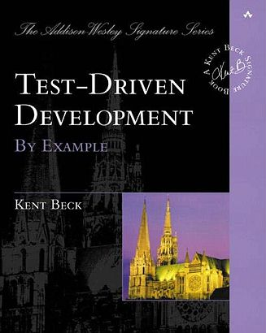

= How not to write tests — 'Unit' Testing in .NET
:revealjs_theme: white
:icons: font
:revealjs_slideNumber: c/t
:revealjs_controls: false
:customcss: nc-template.css

Revising classic approach to unit testing and finding pitfalls in it.
Improving code and tests based on TDD and BDD approaches.

== Description

== Agenda

. $ whoami
. Glossary
. Recommendations
. Key takeaways (lightning talk version)
. But why?
. Characteristics of classic unit tests
. Problems
. Band-aids
. 'Good developers write bad tests'
. Benefits of TDD flow

== Recommendations

== 🚀 DevTernity 2017: Ian Cooper - TDD, Where Did It All Go Wrong
video::EZ05e7EMOLM[youtube]

== https://www.amazon.com/Test-Driven-Development-Kent-Beck/dp/0321146530['Test Driven Development: By Example' by Kent Beck]

== https://mtlynch.io/good-developers-bad-tests/[Why Good Developers Write Bad Unit Tests]

image::good-developers-write-bad-tests.jpg[]

== Key takeaways
* Write a test when a new requirement comes, not when you create new class/method.
* Use encapsulation in a module. Keep implementation details in private classes, test only public ones.
* Use mocks only when super necessary i.e., with databases, network, files etc.
* TDD lets you focus on one thing at a time. First working solution then good design.

== !
* Good test shouldn't break when refactoring the code.
* Isolate tests from each other, not classes.
* When using hexagonal architecture test only ports/use cases.

== Characteristics of classic unit tests

== Things to talk about
. Only test requirements
. What is 'unit'
. What should be isolated in unit testing (tests, not class)
. Benefits of red-green-refactor
. Tests are needed for refactoring to keep code clean
. why mocks are bad
. less tests = less time
. refactoring shouldn't break any tests
. less mocks = less tests breaking
. don't test implementation details
. what should be mocked -> external stuff: files, database, web
. maybe something about good developers write bad tests
. test naming
. ioc in tests - yay or nay

